<div align="center">


\# 🚚 Smart Logistics Management System


\*\*A role-based logistics management backend for shipment requests, driver assignment, shipment tracking, GPS location updates, ETA calculation, and real-time notifications.\*\*


Built with \*\*ASP.NET Core 8\*\*, \*\*Clean Architecture\*\*, \*\*CQRS/MediatR\*\*, \*\*Entity Framework Core\*\*, \*\*SQL Server\*\*, \*\*JWT Authentication\*\*, and \*\*SignalR\*\*.


!\[.NET](https://img.shields.io/badge/.NET-8.0-512BD4?logo=dotnet\\\&logoColor=white)

!\[C#](https://img.shields.io/badge/C%23-12-239120?logo=csharp\\\&logoColor=white)

!\[SQL Server](https://img.shields.io/badge/SQL%20Server-EF%20Core%208-CC2927?logo=microsoftsqlserver\\\&logoColor=white)

!\[JWT](https://img.shields.io/badge/Auth-JWT-000000?logo=jsonwebtokens\\\&logoColor=white)

!\[SignalR](https://img.shields.io/badge/SignalR-Real--Time-0078D4)

!\[Swagger](https://img.shields.io/badge/API%20Docs-Swagger-85EA2D?logo=swagger\\\&logoColor=black)


</div>


\---


\## 📌 Overview


\*\*Smart Logistics Management System\*\* is a RESTful backend API designed to manage the logistics and shipment lifecycle from the initial customer request until delivery.


The system supports:


\* Customer shipment requests with multiple items.

\* Request approval, rejection, update, and cancellation workflows.

\* Shipment creation from approved requests.

\* Driver and vehicle assignment.

\* Shipment status lifecycle management.

\* Automatic shipment tracking history.

\* Driver GPS location updates.

\* Distance and ETA calculation using the Haversine formula.

\* Real-time notifications using SignalR.

\* JWT authentication with role-based authorization.

\* Refresh token rotation.

\* Soft deletion for preserving records and history.


\---


\## ✨ Key Features


| Feature                           | Description                                                                                               |

| --------------------------------- | --------------------------------------------------------------------------------------------------------- |

| 🔐 \*\*JWT Authentication\*\*         | Access-token authentication with issuer, audience, lifetime, signing-key validation, and zero clock skew. |

| 🔄 \*\*Refresh Tokens\*\*             | Refresh tokens are stored in the database, expire after 7 days, and are rotated when used.                |

| 👥 \*\*Role-Based Authorization\*\*   | Four roles: `Admin`, `Employee`, `Driver`, and `Customer`.                                                |

| 📝 \*\*Shipment Requests\*\*          | Customers create requests containing destination information and multiple shipment items.                 |

| 🔄 \*\*Request Workflow\*\*           | Requests can move between `Pending`, `Approved`, `Rejected`, and `Cancelled` according to business rules. |

| 🚚 \*\*Shipment Management\*\*        | Approved requests can be converted into shipments.                                                        |

| 👨‍✈️ \*\*Driver Assignment\*\*       | Shipments can be assigned to drivers together with their registered vehicles.                             |

| 🚛 \*\*Assignment Validation\*\*      | A driver must have a vehicle, and neither driver nor vehicle can already have an active shipment.         |

| 🔄 \*\*Shipment Lifecycle\*\*         | `Created → Assigned → PickedUp → InTransit → Delivered`, with cancellation supported from active states.  |

| 📍 \*\*GPS Tracking\*\*               | Drivers can send latitude and longitude updates for their assigned shipments.                             |

| 📏 \*\*Distance Calculation\*\*       | Remaining distance is calculated using the Haversine formula.                                             |

| ⏱️ \*\*ETA Calculation\*\*            | Estimated arrival time is calculated using the remaining distance and an average speed of 40 km/h.        |

| 🔔 \*\*SignalR Notifications\*\*      | Assignment, status, and location updates are pushed to connected users in real time.                      |

| 📚 \*\*Automatic Tracking History\*\* | Every shipment status change creates a `ShipmentTracking` record automatically.                           |

| 🗑️ \*\*Soft Delete\*\*               | Records use `IsDeleted` instead of physical deletion where supported.                                     |

| 📖 \*\*Swagger / OpenAPI\*\*          | Interactive API documentation with JWT authorization support.                                             |


\---


\## 🏗️ Architecture


The project follows \*\*Clean Architecture\*\* with a layered solution.


```mermaid

flowchart LR


&#x20;   API\["🌐 API

&#x20;   Controllers

&#x20;   SignalR Hub

&#x20;   Authentication"]


&#x20;   INF\["🗄️ Infrastructure

&#x20;   EF Core

&#x20;   SQL Server

&#x20;   Repositories

&#x20;   ETA Service"]


&#x20;   APP\["⚙️ Application

&#x20;   CQRS

&#x20;   MediatR

&#x20;   Commands

&#x20;   Queries

&#x20;   Handlers

&#x20;   DTOs"]


&#x20;   DOM\["💎 Domain

&#x20;   Entities

&#x20;   Enums

&#x20;   Interfaces"]


&#x20;   API --> INF

&#x20;   INF --> APP

&#x20;   APP --> DOM

```


\### Main architectural principles


\* \*\*Clean Architecture\*\*

\* \*\*CQRS\*\*

\* \*\*MediatR\*\*

\* \*\*Repository Pattern\*\*

\* \*\*Dependency Injection\*\*

\* \*\*DTO-based API responses\*\*

\* \*\*Role-based authorization\*\*

\* \*\*Ownership checks inside application handlers\*\*

\* \*\*Separation between Domain, Application, Infrastructure, and API\*\*


\---


\## 📂 Project Structure


```text

Smart\_Logistics\_Mangment/

│

├── Smart\_Logistics\_Mangment\_System.API/

│   ├── Controllers/

│   ├── Hubs/

│   │   └── NotificationHub.cs

│   ├── Services/

│   │   ├── CurrentUserService.cs

│   │   └── NotificationService.cs

│   ├── wwwroot/

│   ├── Program.cs

│   └── appsettings.json

│

├── Smart\_Logistics\_Mangment\_System.Application/

│   ├── AppUsers/

│   ├── Customers/

│   ├── Drivers/

│   ├── Employees/

│   ├── Notifications/

│   ├── RefreshTokenss/

│   ├── ShipmentItems/

│   ├── ShipmentRequests/

│   ├── Shipments/

│   ├── ShipmentTrakings/

│   ├── Vehicles/

│   ├── Warehouses/

│   └── Extentions/

│

├── Smart\_Logistics\_Mangment\_System.Domain/

│   ├── Models/

│   ├── Enums/

│   └── Interfaces/

│

└── Smart\_Logistics\_Mangment\_System.Infrastruction/

&#x20;   ├── DB\_Context/

&#x20;   ├── Configurations/

&#x20;   ├── Migrations/

&#x20;   ├── Reposatories/

&#x20;   └── Extentions/

```


\---


\## 🧩 Domain Model


The main domain entities are:


\* `AppUser`

\* `Customer`

\* `Driver`

\* `Employee`

\* `RefreshToken`

\* `ShipmentRequest`

\* `ShipmentItem`

\* `Shipment`

\* `ShipmentLocation`

\* `ShipmentTracking`

\* `Vehicle`

\* `Warehouse`


All entities inherit from:


```text

BaseEntity

├── Id

├── CreatedAt

├── UpdatedAt

└── IsDeleted

```


\### Entity Relationships


```mermaid

erDiagram


&#x20;   AppUser ||--o| Customer : has

&#x20;   AppUser ||--o| Driver : has

&#x20;   AppUser ||--o| Employee : has

&#x20;   AppUser ||--o{ RefreshToken : owns


&#x20;   Customer ||--o{ ShipmentRequest : creates

&#x20;   Customer ||--o{ Shipment : receives


&#x20;   Warehouse ||--o{ ShipmentRequest : pickup

&#x20;   Warehouse ||--o{ Shipment : pickup


&#x20;   ShipmentRequest ||--o{ ShipmentItem : contains

&#x20;   ShipmentRequest |o--o| Shipment : creates


&#x20;   Driver |o--o| Vehicle : uses


&#x20;   Driver ||--o{ Shipment : assigned

&#x20;   Vehicle ||--o{ Shipment : carries


&#x20;   Shipment ||--o{ ShipmentItem : contains

&#x20;   Shipment ||--o{ ShipmentLocation : records

&#x20;   Shipment ||--o{ ShipmentTracking : tracks

```


\---


\## 🔄 Shipment Request Workflow


A customer starts the process by creating a shipment request.


```mermaid

flowchart TD


&#x20;   A\["Customer creates Shipment Request"]

&#x20;   B\["Pending"]

&#x20;   C\["Admin / Employee reviews"]

&#x20;   D\["Approved"]

&#x20;   E\["Rejected"]

&#x20;   F\["Customer cancels"]

&#x20;   G\["Shipment created"]

&#x20;   

&#x20;   A --> B

&#x20;   B --> C

&#x20;   C --> D

&#x20;   C --> E

&#x20;   B --> F

&#x20;   D --> G

```


\### Request statuses


```text

Pending

Approved

Rejected

Cancelled

```


\### Main rules


\* Only a `Customer` can create a shipment request.

\* Customers can access their own requests.

\* Admins and Employees can review requests.

\* Admins and Employees can approve or reject requests.

\* A Customer can cancel their own pending request.

\* Only an approved request can be converted into a shipment.

\* Shipment item total weight is calculated as part of shipment creation.


\---


\## 🚚 Shipment Lifecycle


The shipment follows a controlled state transition workflow.

```mermaid

stateDiagram-v2



&#x20;   \[\*] --> Created



&#x20;   Created --> Assigned

&#x20;   Created --> Cancelled



&#x20;   Assigned --> PickedUp

&#x20;   Assigned --> Cancelled



&#x20;   PickedUp --> InTransit

&#x20;   PickedUp --> Cancelled



&#x20;   InTransit --> Delivered

&#x20;   InTransit --> Cancelled



&#x20;   Delivered --> \[\*]

&#x20;   Cancelled --> \[\*]

```





\### Shipment statuses


```text

Created

Assigned

PickedUp

InTransit

Delivered

Cancelled

```


Invalid status transitions are rejected by the application layer.


`Delivered` and `Cancelled` are terminal states.


\---


\## 👥 Roles \& Permissions


The system contains four roles:


```text

Admin

Employee

Driver

Customer

```


\### Authentication


| Action        | Admin | Employee | Driver | Customer |

| ------------- | :---: | :------: | :----: | :------: |

| Register      |   ❌   |     ❌    |    ❌   |     ✅    |

| Login         |   ✅   |     ✅    |    ✅   |     ✅    |

| Refresh Token |   ✅   |     ✅    |    ✅   |     ✅    |


\### Users \& Employees


| Action           | Admin | Employee | Driver | Customer |

| ---------------- | :---: | :------: | :----: | :------: |

| View users       |   ✅   |     ❌    |    ❌   |     ❌    |

| Manage employees |   ✅   |     ❌    |    ❌   |     ❌    |


\### Customers


| Action          | Admin | Employee | Driver | Customer |

| --------------- | :---: | :------: | :----: | :------: |

| View customers  |   ✅   |     ✅    |    ❌   | Own data |

| Update customer |   ✅   |     ✅    |    ❌   | Own data |

| Delete customer |   ✅   |     ❌    |    ❌   |     ❌    |


\### Drivers


| Action        | Admin | Employee |  Driver  | Customer |

| ------------- | :---: | :------: | :------: | :------: |

| View drivers  |   ✅   |     ✅    |     ✅    |     ❌    |

| Create driver |   ✅   |     ✅    |     ❌    |     ❌    |

| Update driver |   ✅   |     ✅    | Own data |     ❌    |

| Delete driver |   ✅   |     ❌    |     ❌    |     ❌    |


\### Shipments


| Action              | Admin | Employee |    Driver    |   Customer   |

| ------------------- | :---: | :------: | :----------: | :----------: |

| View all shipments  |   ✅   |     ✅    |       ❌      |       ❌      |

| Create shipment     |   ✅   |     ✅    |       ❌      |       ❌      |

| Update shipment     |   ✅   |     ✅    |       ❌      |       ❌      |

| Assign driver       |   ✅   |     ✅    |       ❌      |       ❌      |

| Update status       |   ✅   |     ✅    | Own shipment |       ❌      |

| Update GPS location |   ❌   |     ❌    | Own shipment |       ❌      |

| Get ETA             |   ✅   |     ✅    | Own shipment | Own shipment |

| Delete shipment     |   ✅   |     ❌    |       ❌      |       ❌      |


\### Shipment Requests


| Action          | Admin | Employee | Driver |   Customer   |

| --------------- | :---: | :------: | :----: | :----------: |

| View requests   |   ✅   |     ✅    |    ❌   | Own requests |

| Create request  |   ❌   |     ❌    |    ❌   |       ✅      |

| Update request  |   ✅   |     ✅    |    ❌   |  Own request |

| Approve request |   ✅   |     ✅    |    ❌   |       ❌      |

| Reject request  |   ✅   |     ✅    |    ❌   |       ❌      |

| Cancel request  |   ❌   |     ❌    |    ❌   |  Own request |

| Delete request  |   ✅   |     ❌    |    ❌   |       ❌      |


\---


\## 🔐 Authentication \& Authorization


The API uses \*\*JWT Bearer Authentication\*\*.


JWT tokens contain user information used by the authorization system, including:


\* User ID

\* Full name

\* Role


Authorization is applied in two levels:


\### 1. Controller-level authorization


Example:


```csharp

\[Authorize(Roles = "Admin,Employee")]

```


\### 2. Application-level ownership checks


Handlers also verify ownership when required.


For example:


\* A driver can only update the status of their assigned shipment.

\* A driver can only update GPS location for their assigned shipment.

\* A customer can only access their own shipment requests.

\* A customer can only access ETA information for their own shipment.


This prevents relying only on controller-level role checks.


\---


\## 🔄 Refresh Token Rotation


The authentication flow supports refresh tokens.


When a user logs in:


1\. An access token is generated.

2\. A refresh token is generated.

3\. The refresh token is stored in the database.

4\. The refresh token expires after \*\*7 days\*\*.


When the refresh token is used:


1\. The existing token is validated.

2\. Expired/revoked tokens are rejected.

3\. The old refresh token is revoked.

4\. A new access token is generated.

5\. A new refresh token is generated and stored.


This provides refresh-token rotation instead of reusing the same refresh token indefinitely.


\---


\## 📡 API Reference


Development HTTPS URL:


```text

https://localhost:7240

```


Swagger:


```text

https://localhost:7240/swagger

```


> The application also contains HTTP/IIS Express launch profiles. The exact URL can depend on the selected Visual Studio launch profile.


\---


\### 🔐 Authentication


Base route:


```text

/api/AcountUsers

```


| Method | Endpoint             | Access |

| ------ | -------------------- | ------ |

| `POST` | `/Register-Customer` | Public |

| `POST` | `/User-login`        | Public |

| `POST` | `/Refresh-Token`     | Public |

| `GET`  | `/`                  | Admin  |

| `GET`  | `/{id}`              | Admin  |


\---


\### 📦 Shipment Requests


Base route:


```text

/api/ShipmentRequest

```


| Method   | Endpoint        | Access                    |

| -------- | --------------- | ------------------------- |

| `GET`    | `/`             | Admin, Employee, Customer |

| `GET`    | `/{id}`         | Admin, Employee, Customer |

| `POST`   | `/`             | Customer                  |

| `PUT`    | `/{id}`         | Admin, Employee, Customer |

| `PUT`    | `/{id}/approve` | Admin, Employee           |

| `PUT`    | `/{id}/reject`  | Admin, Employee           |

| `PUT`    | `/{id}/cancel`  | Customer                  |

| `DELETE` | `/{id}`         | Admin                     |


Customer ownership is checked inside the application handlers.


\---


\### 🚚 Shipments


Base route:


```text

/api/Shipment

```


| Method   | Endpoint           | Access                  |

| -------- | ------------------ | ----------------------- |

| `GET`    | `/`                | Admin, Employee         |

| `GET`    | `/{id}`            | Admin, Employee         |

| `POST`   | `/`                | Admin, Employee         |

| `PUT`    | `/{id}`            | Admin, Employee         |

| `PUT`    | `/{id}/assign`     | Admin, Employee         |

| `PUT`    | `/Update-Status`   | Admin, Employee, Driver |

| `PUT`    | `/Update-Location` | Driver                  |

| `GET`    | `/{id}/ETA`        | Authenticated users     |

| `DELETE` | `/{id}`            | Admin                   |


The ETA endpoint additionally performs ownership checks for Customers and Drivers.


\---


\### 🚗 Drivers


Base route:


```text

/api/Drivers

```


| Method   | Endpoint | Access                  |

| -------- | -------- | ----------------------- |

| `GET`    | `/`      | Admin, Employee, Driver |

| `GET`    | `/{id}`  | Admin, Employee, Driver |

| `POST`   | `/`      | Admin, Employee         |

| `PUT`    | `/{id}`  | Admin, Employee, Driver |

| `DELETE` | `/{id}`  | Admin                   |


\---


\### 👤 Customers


Base route:


```text

/api/Customers

```


| Method   | Endpoint | Access                    |

| -------- | -------- | ------------------------- |

| `GET`    | `/`      | Admin, Employee, Customer |

| `GET`    | `/{id}`  | Admin, Employee, Customer |

| `PUT`    | `/{id}`  | Admin, Employee, Customer |

| `DELETE` | `/{id}`  | Admin                     |


\---


\### 👨‍💼 Employees


Base route:


```text

/api/Employee

```


All Employee endpoints are restricted to `Admin`.


| Method   | Endpoint | Access |

| -------- | -------- | ------ |

| `GET`    | `/`      | Admin  |

| `GET`    | `/{id}`  | Admin  |

| `POST`   | `/`      | Admin  |

| `PUT`    | `/{id}`  | Admin  |

| `DELETE` | `/{id}`  | Admin  |


\---


\### 🚛 Vehicles


Base route:


```text

/api/Vehicle

```


| Method   | Endpoint | Access          |

| -------- | -------- | --------------- |

| `GET`    | `/`      | Admin, Employee |

| `GET`    | `/{id}`  | Admin, Employee |

| `POST`   | `/`      | Admin, Employee |

| `PUT`    | `/{id}`  | Admin, Employee |

| `DELETE` | `/{id}`  | Admin           |


\---


\### 🏭 Warehouses


Base route:


```text

/api/Warehouse

```


| Method   | Endpoint | Access          |

| -------- | -------- | --------------- |

| `GET`    | `/`      | Admin, Employee |

| `GET`    | `/{id}`  | Admin, Employee |

| `POST`   | `/`      | Admin, Employee |

| `PUT`    | `/{id}`  | Admin, Employee |

| `DELETE` | `/{id}`  | Admin           |


\---


\### 📦 Shipment Items


Base route:


```text

/api/ShipmentItem

```


| Method   | Endpoint | Access          |

| -------- | -------- | --------------- |

| `GET`    | `/`      | Admin, Employee |

| `GET`    | `/{id}`  | Admin, Employee |

| `POST`   | `/`      | Admin, Employee |

| `PUT`    | `/{id}`  | Admin, Employee |

| `DELETE` | `/{id}`  | Admin           |


\---


\### 📍 Shipment Tracking


Base route:


```text

/api/ShipmentTracking

```


| Method   | Endpoint | Access                  |

| -------- | -------- | ----------------------- |

| `GET`    | `/`      | Admin, Employee, Driver |

| `GET`    | `/{id}`  | Admin, Employee, Driver |

| `PUT`    | `/{id}`  | Admin, Employee, Driver |

| `DELETE` | `/{id}`  | Admin                   |


Shipment tracking records are also created automatically when the shipment status changes.


\---


\## 🔔 Real-Time Notifications


The project uses \*\*ASP.NET Core SignalR\*\* for real-time notifications.


Hub endpoint:


```text

/notificationHub

```


The hub requires authentication.


When a user connects, the system places the connection into:


```text

User\_{userId}

```


This allows notifications to be sent to a specific authenticated user.


\### Notification events


\#### Shipment assignment


When a shipment is assigned:


\* Driver receives a notification.

\* Customer receives a notification.


\#### Shipment status update


When shipment status changes:


\* Assigned driver receives a notification.

\* Customer receives a notification.


\#### Location update


When a driver sends a GPS location:


The customer receives information including:


```json

{

&#x20; "type": "ShipmentLocationUpdated",

&#x20; "shipmentId": 31,

&#x20; "latitude": 31.0409,

&#x20; "longitude": 31.3785,

&#x20; "distanceKm": 10.52,

&#x20; "estimatedMinutes": 16,

&#x20; "estimatedTime": "16m"

}

```


Client event:


```text

ReceiveNotification

```


\---


\## 📍 GPS Tracking \& ETA


Drivers can update the current location of their assigned shipment using:


```http

PUT /api/Shipment/Update-Location

```


Example:


```json

{

&#x20; "shipmentId": 31,

&#x20; "latitude": 31.0409,

&#x20; "longitude": 31.3785

}

```


The API performs the following steps:


1\. Verifies that the shipment exists.

2\. Verifies that the authenticated user is a Driver.

3\. Verifies that the driver is assigned to the shipment.

4\. Validates latitude and longitude ranges.

5\. Stores the location in `ShipmentLocation`.

6\. Calculates the remaining distance.

7\. Calculates the estimated travel time.

8\. Sends the result to the customer through SignalR.


\### Supported shipment statuses for location updates


```text

Assigned

PickedUp

InTransit

```


Location updates are rejected after the shipment reaches:


```text

Delivered

Cancelled

```


\---


\## 📏 Haversine Distance Calculation


The system calculates the straight-line distance between the driver's current location and the shipment destination.


The Haversine formula is used:


```text

a =

sin²(Δlat / 2)

\+

cos(lat1) × cos(lat2) × sin²(Δlon / 2)


distance =

2 × R × atan2(√a, √(1 − a))

```


Where:


```text

R = 6371 km

```


\---


\## ⏱️ ETA Calculation


The current ETA service uses a constant average speed:


```text

40 km/h

```


Estimated minutes:


```text

minutes = ceil(distance / 40 × 60)

```


If the remaining distance is zero, the API returns:


```text

Arrived

```


\### Important


This is a \*\*straight-line ETA estimate\*\*, not a road-routing calculation.


It does not currently use:


\* Google Maps

\* OSRM

\* OpenStreetMap routing

\* Live traffic data

\* Road network distance


\---


\## 🚛 Driver \& Vehicle Assignment


When an Admin or Employee assigns a shipment to a driver, the system verifies:


\### Driver exists


The selected driver must exist.


\### Driver has a vehicle


The driver must have a registered vehicle.


\### Driver availability


The driver cannot already have another active shipment.


\### Vehicle availability


The driver's vehicle cannot already be assigned to another active shipment.


The active shipment check excludes:


```text

Delivered

Cancelled

```


After successful validation:


```text

Shipment.DriverId = Driver.Id

Shipment.VehicleId = Driver.VehicleId

Shipment.Status = Assigned

```


\---


\## 🧾 Automatic Shipment Tracking


Every shipment status update creates a `ShipmentTracking` record.


Tracking contains information such as:


\* Shipment ID

\* Status

\* Location

\* Note

\* Timestamp through `BaseEntity`


Example lifecycle:


```text

Assigned

&#x20;  ↓

ShipmentTracking


PickedUp

&#x20;  ↓

ShipmentTracking


InTransit

&#x20;  ↓

ShipmentTracking


Delivered

&#x20;  ↓

ShipmentTracking

```


This creates a history of shipment status changes.


\---


\## 🗑️ Soft Delete


The system uses soft deletion for supported resources.


Instead of physically removing a record:


```text

IsDeleted = true

```


This allows historical information to remain in the database.


\---


\## 🛠️ Technology Stack


| Category                | Technology                      |

| ----------------------- | ------------------------------- |

| Framework               | ASP.NET Core 8 Web API          |

| Language                | C# 12                           |

| Architecture            | Clean Architecture              |

| Application Pattern     | CQRS                            |

| Mediator                | MediatR                         |

| ORM                     | Entity Framework Core 8         |

| Database                | SQL Server                      |

| Authentication          | JWT Bearer                      |

| Refresh Authentication  | Refresh Tokens                  |

| Password Hashing        | BCrypt.Net-Next                 |

| Mapping                 | AutoMapper                      |

| Real-Time Communication | ASP.NET Core SignalR            |

| API Documentation       | Swagger / OpenAPI               |

| Data Access             | Repository Pattern              |

| Database Management     | EF Core Code First + Migrations |


\---


\## 🚀 Getting Started


\### Prerequisites


Install:


\* \[.NET 8 SDK](https://dotnet.microsoft.com/download/dotnet/8.0)

\* SQL Server

\* Visual Studio 2022 or another compatible .NET development environment

\* Entity Framework Core CLI tools


Install EF Core CLI if needed:


```bash

dotnet tool install --global dotnet-ef

```


\---


\### 1. Clone the repository


```bash

git clone https://github.com/<your-username>/Smart\_Logistics\_Mangment.git

cd Smart\_Logistics\_Mangment

```


\---


\### 2. Configure the database


The API expects the connection string:


```text

ConnectionStrings:CS

```


For local development, use \*\*ASP.NET Core User Secrets\*\* instead of committing database credentials.


From the API project:


```bash

cd Smart\_Logistics\_Mangment\_System.API

dotnet user-secrets init

```


Then configure:


```bash

dotnet user-secrets set "ConnectionStrings:CS" "YOUR\_CONNECTION\_STRING"

```


Configure the JWT key:


```bash

dotnet user-secrets set "Jwt:Key" "YOUR\_LONG\_RANDOM\_JWT\_SECRET"

```


The public configuration can contain:


```json

{

&#x20; "Jwt": {

&#x20;   "Issuer": "SmartLogisticsAPI",

&#x20;   "Audience": "SmartLogisticsClient",

&#x20;   "DurationInMinutes": 60

&#x20; }

}

```


\*\*Never commit real connection strings or JWT secrets to GitHub.\*\*


\---


\### 3. Create / update the database


From the API project:


```bash

dotnet ef database update --project ../Smart\_Logistics\_Mangment\_System.Infrastruction --startup-project .

```


The project uses EF Core migrations stored in the Infrastructure project.


\---


\### 4. Run the API


```bash

dotnet run

```


Or run the project using Visual Studio.


Development HTTPS URL:


```text

https://localhost:7240

```


Swagger:


```text

https://localhost:7240/swagger

```


\---


\## 👤 Creating Users


\### Customer


Customer registration is public:


```http

POST /api/AcountUsers/Register-Customer

```


Example:


```json

{

&#x20; "fullName": "Ahmed Ali",

&#x20; "email": "ahmed@example.com",

&#x20; "password": "P@ssw0rd123",

&#x20; "companyName": "Ali Trading",

&#x20; "address": "Mansoura, Egypt"

}

```


New public registrations are assigned the:


```text

Customer

```


role.


\### Admin / Employee / Driver


Admin, Employee, and Driver accounts are managed according to the application's role-based workflow rather than allowing arbitrary public role creation.


\---


\## 🧪 Example Workflow


A typical shipment lifecycle is:


```text

1\. Customer registers

&#x20;       ↓

2\. Customer logs in

&#x20;       ↓

3\. Customer creates ShipmentRequest

&#x20;       ↓

4\. Request starts as Pending

&#x20;       ↓

5\. Admin / Employee approves request

&#x20;       ↓

6\. Admin / Employee creates Shipment

&#x20;       ↓

7\. Shipment starts as Created

&#x20;       ↓

8\. Admin / Employee assigns Driver

&#x20;       ↓

9\. Driver + Vehicle are assigned

&#x20;       ↓

10\. Shipment becomes Assigned

&#x20;       ↓

11\. Driver updates status to PickedUp

&#x20;       ↓

12\. Driver updates status to InTransit

&#x20;       ↓

13\. Driver sends GPS location

&#x20;       ↓

14\. API calculates distance + ETA

&#x20;       ↓

15\. Customer receives SignalR notification

&#x20;       ↓

16\. Driver updates status to Delivered

&#x20;       ↓

17\. ShipmentTracking history contains the lifecycle

```


\---


\## 🔒 Security


The application includes several security mechanisms:


\* JWT Bearer Authentication.

\* Role-based authorization.

\* BCrypt password hashing.

\* JWT issuer validation.

\* JWT audience validation.

\* JWT lifetime validation.

\* JWT signing-key validation.

\* Zero clock skew.

\* Refresh-token expiration.

\* Refresh-token revocation.

\* Refresh-token rotation.

\* Ownership checks inside application handlers.

\* Authenticated SignalR connections.

\* Per-user SignalR groups.

\* Coordinate validation for GPS updates.

\* Shipment status transition validation.


\---


\## 🗺️ Future Improvements


Possible future improvements include:


\* \[ ] Unit tests for handlers and business rules.

\* \[ ] Global exception-handling middleware with consistent `ProblemDetails`.

\* \[ ] FluentValidation for request validation.

\* \[ ] Pagination, filtering, and sorting.

\* \[ ] Automatic `VehicleStatus` updates during shipment lifecycle.

\* \[ ] More advanced SignalR browser authentication configuration.

\* \[ ] Restrict CORS to known production origins.

\* \[ ] Road-aware ETA using a routing service instead of straight-line distance.

\* \[ ] Docker / Docker Compose support.

\* \[ ] CI/CD pipeline using GitHub Actions.

\* \[ ] Automated database seeding for development environments.


\---


\## 📌 Project Status


The current project implements the main logistics workflow:


```text

Authentication

&#x20;      ↓

Shipment Requests

&#x20;      ↓

Approval / Rejection

&#x20;      ↓

Shipment Creation

&#x20;      ↓

Driver + Vehicle Assignment

&#x20;      ↓

Shipment Lifecycle

&#x20;      ↓

GPS Location Tracking

&#x20;      ↓

Distance + ETA

&#x20;      ↓

SignalR Notifications

&#x20;      ↓

Shipment Tracking History

```


\---


\## 👨‍💻 Author


\*\*Youssef Salah\*\*


GitHub: `your-github-username`


LinkedIn: `your-linkedin-profile`


\---


<div align="center">


\### ⭐ Smart Logistics Management System


Built with ASP.NET Core 8 · Clean Architecture · CQRS · JWT · SignalR


</div>


